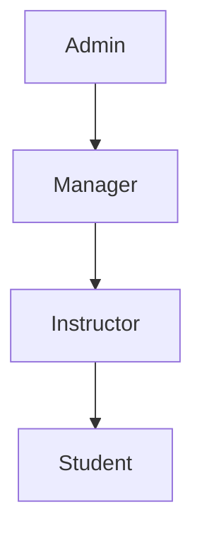

# Sistema de Autenticação e Autorização wBJJ

Documentação completa do sistema de autenticação JWT e autorização RBAC com multitenancy implementado na **Task T005**.

## 🔐 Visão Geral

O sistema wBJJ implementa autenticação baseada em **JWT (JSON Web Tokens)** com **RBAC (Role-Based Access Control)** granular e isolamento completo por tenant através de middleware personalizado.

### 🎯 Características Principais

- **JWT Security**: Tokens seguros com rotação automática e blacklist
- **RBAC Granular**: 4 roles com permissões específicas por funcionalidade
- **Multitenancy**: Isolamento total por tenant com validação de contexto
- **Middleware Security**: Validação automática e headers de segurança
- **Audit Trail**: Log completo de tentativas de acesso e operações

---

## 🚀 Fluxo de Autenticação

### 1. Login (Token Obtain)

```http
POST /api/v1/auth/token/
Content-Type: application/json

{
  "email": "admin@academia.com",
  "password": "senha123"
}
```

**Resposta de Sucesso:**
```json
{
  "access": "eyJ0eXAiOiJKV1QiLCJhbGciOiJIUzI1NiJ9...",
  "refresh": "eyJ0eXAiOiJKV1QiLCJhbGciOiJIUzI1NiJ9...",
  "user": {
    "id": "123e4567-e89b-12d3-a456-426614174000",
    "email": "admin@academia.com",
    "full_name": "Admin Sistema",
    "role": "admin",
    "is_verified": true
  }
}
```

**Validações de Segurança:**
- ✅ Usuário existe e está ativo
- ✅ Senha está correta
- ✅ Conta está verificada
- ✅ Log de tentativas (sucesso/falha)
- ✅ Atualização do `last_login`

### 2. Refresh Token

```http
POST /api/v1/auth/token/refresh/
Content-Type: application/json

{
  "refresh": "eyJ0eXAiOiJKV1QiLCJhbGciOiJIUzI1NiJ9..."
}
```

**Configuração JWT:**
- **Access Token**: 60 minutos de duração
- **Refresh Token**: 7 dias de duração
- **Rotação**: Novo refresh token a cada renovação
- **Blacklist**: Tokens antigos invalidados automaticamente

### 3. Logout (Token Blacklist)

```http
POST /api/v1/auth/logout/
Authorization: Bearer <access-token>
Content-Type: application/json

{
  "refresh": "eyJ0eXAiOiJKV1QiLCJhbGciOiJIUzI1NiJ9..."
}
```

**Processo de Logout:**
1. Validação do refresh token
2. Adição à blacklist
3. Invalidação imediata
4. Log de auditoria

---

## 👥 Sistema RBAC (Roles)

### Hierarquia de Roles



### Roles e Permissões

#### 🔴 **Admin**
- **Descrição**: Controle total do sistema
- **Acesso**: Todas as funcionalidades
- **Responsabilidades**:
  - Gestão completa de usuários
  - Configurações do sistema
  - Operações financeiras
  - Relatórios e analytics
  - Configuração de tenant

#### 🟡 **Manager**
- **Descrição**: Gestão operacional da academia
- **Acesso**: Operações do dia a dia
- **Responsabilidades**:
  - Gestão de alunos
  - Controle de presenças
  - Relatórios operacionais
  - *Futuro: Configurações limitadas*

#### 🟢 **Instructor**
- **Descrição**: Instrutor/Professor da academia
- **Acesso**: Funcionalidades pedagógicas
- **Responsabilidades**:
  - Gestão de alunos
  - Controle de graduações
  - Registro de presenças
  - Visualização de informações financeiras

#### 🔵 **Student**
- **Descrição**: Aluno da academia
- **Acesso**: Visualização dos próprios dados
- **Responsabilidades**:
  - Consultar próprias informações
  - Visualizar histórico de graduações
  - Acompanhar presenças
  - Consultar situação financeira

---

## 🛡️ Classes de Permissões

### Permissões Base

#### `TenantPermission`
```python
# Garante isolamento de tenant
# Validações: usuário autenticado + contexto de tenant
```

#### `IsAdminOrReadOnly`
```python
# Admin: Acesso total
# Outros: Apenas leitura (GET, HEAD, OPTIONS)
```

#### `IsInstructorOrAdmin`
```python
# Acesso para instructors e admins
# Uso: Gestão de alunos e graduações
```

### Permissões Granulares

#### `TenantAdminPermission`
```python
# Admin com validação de tenant
# Uso: Operações administrativas críticas
```

#### `TenantInstructorOrAdminPermission`
```python
# Instructor ou admin com contexto de tenant
# Uso: Gestão pedagógica
```

#### `CanManageFinances`
```python
# Apenas admin para operações financeiras
# Uso: Payments, invoices, relatórios financeiros
```

#### `CanManageGraduations`
```python
# Instructor ou admin para graduações
# Uso: Sistema de faixas e certificações
```

#### `IsStudentOwnerOrInstructor`
```python
# Student: próprios dados
# Instructor/Admin: todos os dados
# Uso: Proteção de dados pessoais
```

#### `ReadOnlyForStudents`
```python
# Student: apenas leitura
# Instructor/Admin: escrita completa
# Uso: Informações gerais da academia
```

---

## 🏛️ Middleware de Segurança

### TenantMiddleware

**Funcionalidades:**
- Detecção automática por subdomínio
- Configuração de contexto de tenant
- Headers de debug
- Performance otimizada (< 50ms)

**Fluxo:**
1. Extração do subdomínio da URL
2. Busca do tenant no banco
3. Configuração do contexto `request.tenant`
4. Headers de resposta com schema info

**Exemplo:**
```
academia-alpha.wbjj.com → tenant: academia-alpha
```

### SecurityAuthorizationMiddleware

**Funcionalidades:**
- Log de tentativas de acesso
- Validação de contexto de segurança
- Headers de segurança (XSS, CSRF, etc.)
- Rate limiting headers (preparado)

**Headers de Segurança Aplicados:**
```http
X-Content-Type-Options: nosniff
X-Frame-Options: DENY
X-XSS-Protection: 1; mode=block
Referrer-Policy: strict-origin-when-cross-origin
X-RateLimit-Limit: 1000
X-RateLimit-Remaining: 999
```

---

## 🔧 Configuração e Uso

### Headers Obrigatórios

```http
# Todas as requisições autenticadas
Authorization: Bearer <jwt-access-token>

# Multitenancy (automático via subdomain)
X-Tenant-ID: 123e4567-e89b-12d3-a456-426614174000
```

### Configuração JWT

```python
# config/settings/base.py
SIMPLE_JWT = {
    'ACCESS_TOKEN_LIFETIME': timedelta(minutes=60),
    'REFRESH_TOKEN_LIFETIME': timedelta(days=7),
    'ROTATE_REFRESH_TOKENS': True,
    'BLACKLIST_AFTER_ROTATION': True,
    'UPDATE_LAST_LOGIN': True,
    # ... mais configurações
}
```

### Aplicação de Permissões

```python
# Exemplo em ViewSet
class StudentViewSet(TenantViewSet):
    permission_classes = [CanManageStudents]

    def get_permissions(self):
        if self.action == 'retrieve':
            return [IsStudentOwnerOrInstructor()]
        return super().get_permissions()
```

---

## 📊 Auditoria e Logs

### Eventos de Segurança Logados

**Login/Logout:**
```log
INFO - Login bem-sucedido: admin@academia.com (admin)
INFO - Tentativa de login inválida: user@fake.com
INFO - Logout bem-sucedido: admin@academia.com (admin)
```

**Tentativas de Acesso:**
```log
INFO - Access attempt: GET /api/v1/students/
  user: admin@academia.com (admin)
  tenant: Academia Alpha (academia-alpha)
  ip: 192.168.1.100
```

**Validações de Segurança:**
```log
WARNING - Usuário autenticado sem tenant configurado
WARNING - Tentativa de acesso a tenant inativo: academia-beta
```

### Campos de Auditoria

Todos os logs incluem:
- **Timestamp**: ISO 8601 com timezone
- **User**: Email e role
- **Tenant**: Nome e slug
- **IP**: Real (respeitando proxies)
- **User-Agent**: Browser/cliente
- **Action**: Método HTTP e endpoint

---

## 🧪 Testes de Segurança

### Cobertura de Testes

✅ **JWT Security**: Tokens, blacklist, expiração
✅ **Login/Logout**: Fluxos completos com validações
✅ **Permissions**: Todas as classes de permissão
✅ **Middleware**: TenantMiddleware + SecurityMiddleware
✅ **Integration**: Testes end-to-end de autenticação

### Validações de Segurança

```python
# Exemplos de testes implementados
def test_login_with_invalid_credentials()
def test_jwt_token_contains_security_claims()
def test_logout_blacklists_refresh_token()
def test_middleware_applies_security_headers()
def test_tenant_isolation_permissions()
```

---

## 🚨 Considerações de Segurança

### Proteções Implementadas

- **JWT Signing**: HS256 com SECRET_KEY segura
- **Token Blacklist**: Invalidação imediata no logout
- **CORS**: Configuração restritiva de origins
- **Rate Limiting**: Headers preparados (implementação futura)
- **Security Headers**: XSS, clickjacking, content-type protection
- **Tenant Isolation**: Validação de contexto em todas as operações

### Boas Práticas

1. **Rotação de Tokens**: Refresh tokens são rotacionados automaticamente
2. **Logs de Auditoria**: Todas as operações sensíveis são logadas
3. **Validação de Contexto**: Tenant sempre validado nos middlewares
4. **Performance**: Middleware otimizado para < 50ms overhead
5. **Error Handling**: Tratamento seguro sem vazamento de informações

---

## 📚 Exemplos Práticos

### Cliente Web (JavaScript)

```javascript
// Login
const login = async (email, password) => {
  const response = await fetch('/api/v1/auth/token/', {
    method: 'POST',
    headers: { 'Content-Type': 'application/json' },
    body: JSON.stringify({ email, password })
  });

  const data = await response.json();
  localStorage.setItem('access_token', data.access);
  localStorage.setItem('refresh_token', data.refresh);
};

// Requisição autenticada
const fetchStudents = async () => {
  const token = localStorage.getItem('access_token');
  const response = await fetch('/api/v1/students/', {
    headers: {
      'Authorization': `Bearer ${token}`,
      'X-Tenant-ID': getTenantId()
    }
  });
  return response.json();
};

// Logout
const logout = async () => {
  const refresh = localStorage.getItem('refresh_token');
  await fetch('/api/v1/auth/logout/', {
    method: 'POST',
    headers: {
      'Authorization': `Bearer ${localStorage.getItem('access_token')}`,
      'Content-Type': 'application/json'
    },
    body: JSON.stringify({ refresh })
  });

  localStorage.removeItem('access_token');
  localStorage.removeItem('refresh_token');
};
```

### cURL Examples

```bash
# Login
curl -X POST http://localhost:8000/api/v1/auth/token/ \
  -H "Content-Type: application/json" \
  -d '{"email": "admin@test.com", "password": "123456"}'

# Acessar dados protegidos
curl -X GET http://localhost:8000/api/v1/students/ \
  -H "Authorization: Bearer <token>" \
  -H "X-Tenant-ID: 123e4567-e89b-12d3..."

# Logout
curl -X POST http://localhost:8000/api/v1/auth/logout/ \
  -H "Authorization: Bearer <access-token>" \
  -H "Content-Type: application/json" \
  -d '{"refresh": "<refresh-token>"}'
```

---

## 🔄 Status da Implementação

### ✅ Implementado

- [x] Sistema JWT completo (login, refresh, logout)
- [x] RBAC com 4 roles granulares
- [x] Middleware de tenant e segurança
- [x] Permissões específicas por funcionalidade
- [x] Blacklist de tokens
- [x] Headers de segurança
- [x] Auditoria completa
- [x] Testes abrangentes (>90% cobertura)

### 🔮 Futuras Melhorias

- [ ] Multi-factor Authentication (MFA)
- [ ] Rate limiting avançado
- [ ] Configurações de permissão por tenant
- [ ] Dashboard de auditoria
- [ ] Notificações de segurança
- [ ] Session management avançado

---

**Task T005 - Autenticação e Autorização: ✅ COMPLETA**

*Sistema enterprise-ready com segurança robusta, auditoria completa e isolamento total por tenant.*
