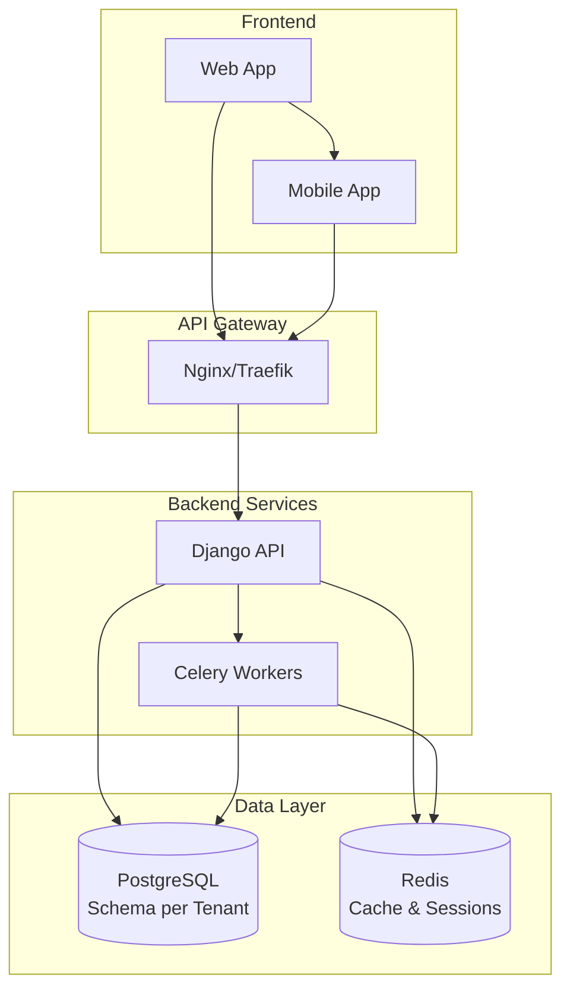

# wBJJ - Sistema de Gestão para Academias de Jiu-Jitsu

<div class="grid cards" markdown>

-   :material-api: __API REST Robusta__

    ---

    Django REST Framework com documentação OpenAPI automática, autenticação JWT e suporte completo a filtros avançados.

    [:octicons-arrow-right-24: Documentação da API](api.md)

-   :material-database: __Multitenancy Nativo__

    ---

    Isolamento total de dados por academia usando schema-per-tenant, garantindo segurança e escalabilidade.

    [:octicons-arrow-right-24: Saiba mais](context.md)

-   :material-docker: __Docker Ready__

    ---

    Ambiente de desenvolvimento completo com Docker Compose. Setup automático em minutos.

    [:octicons-arrow-right-24: Guia Docker](docker.md)

-   :material-shield-check: __Segurança Avançada__

    ---

    JWT tokens, permissions granulares, headers de segurança e middleware customizado para máxima proteção.

    [:octicons-arrow-right-24: Autenticação](api.md)

</div>

## :rocket: Início Rápido

=== "Docker (Recomendado)"

    ```bash
    # Clone o repositório
    git clone https://github.com/wbjj/backend.git
    cd backend

    # Execute o setup automático
    ./scripts/dev-setup.sh

    # Acesse a aplicação
    # 🌐 API: http://localhost:8000
    # 📚 Docs: http://localhost:8000/api/docs/
    ```

=== "Instalação Local"

    ```bash
    # Instalar dependências com UV
    uv sync

    # Configurar banco de dados
    python manage.py migrate

    # Criar superusuário
    python manage.py createsuperuser

    # Executar servidor
    python manage.py runserver
    ```

## :fire: Características Principais

### :gear: Funcionalidades Core

- [x] **Gestão Completa de Alunos** - Cadastro, graduações, presenças e histórico
- [x] **Sistema Financeiro** - Faturas, pagamentos, métodos e relatórios
- [x] **Multitenancy Seguro** - Isolamento total por academia
- [x] **Autenticação JWT** - Tokens seguros com refresh automático
- [x] **API RESTful** - Endpoints padronizados com documentação completa
- [x] **Admin Customizado** - Interface administrativa com tema da academia

### :zap: Performance & DevOps

- [x] **Cache Inteligente** - Redis + django-cachalot para ORM
- [x] **Paginação Automática** - Listagens otimizadas com metadados
- [x] **Health Checks** - Monitoramento completo da aplicação
- [x] **Logs Estruturados** - Debugging avançado com structlog
- [x] **Docker Production-Ready** - Multi-stage builds otimizados
- [x] **Testes Automatizados** - Cobertura > 80% com pytest

### :art: Experiência do Desenvolvedor

- [x] **Documentação Interativa** - Swagger/ReDoc automático
- [x] **Code Quality** - Ruff + pre-commit hooks
- [x] **Type Hints** - Tipagem completa Python 3.11+
- [x] **Hot Reload** - Desenvolvimento com auto-reload
- [x] **Seed Data** - Dados de desenvolvimento prontos
- [x] **Error Handling** - Tratamento elegante de erros

## :books: Documentação

| Seção | Descrição |
|-------|-----------|
| [🚀 Primeiros Passos](docker.md) | Setup completo com Docker |
| [📚 Desenvolvimento](context.md) | Padrões e arquitetura |
| [🔌 API](api.md) | Documentação completa da API |
| [🎨 Customização](customization.md) | Temas e personalização |
| [💡 Exemplos](usage.md) | Casos de uso práticos |

## :warning: Pré-requisitos

| Tecnologia | Versão | Obrigatório |
|------------|---------|-------------|
| Python | 3.11+ | :material-check: |
| PostgreSQL | 15+ | :material-check: |
| Redis | 7+ | :material-check: |
| Docker | 24+ | :material-information: Recomendado |
| UV | Latest | :material-check: |

## :building_construction: Arquitetura



## :trophy: Qualidade & Padrões

!!! success "Padrões de Excelência"

    - **:material-check-circle: Code Coverage**: > 80%
    - **:material-check-circle: Response Time**: < 200ms (P95)
    - **:material-check-circle: Uptime**: > 99.9%
    - **:material-check-circle: Security**: Headers + JWT + Permissions
    - **:material-check-circle: Documentation**: 100% dos endpoints

!!! tip "Desenvolvimento Ágil"

    Este projeto segue princípios de **clean code**, **DRY**, **KISS** e padrões estabelecidos no [contexto técnico](context.md). Focamos em produtividade sem comprometer qualidade.

## :handshake: Contribuindo

1. **Fork** o repositório
2. **Clone** seu fork
3. **Configure** o ambiente com `./scripts/dev-setup.sh`
4. **Crie** sua feature branch
5. **Commit** seguindo [Conventional Commits](https://conventionalcommits.org/)
6. **Teste** com `pytest` (cobertura > 80%)
7. **Push** e abra um **Pull Request**

## :phone: Suporte

- **:material-github: Issues**: [GitHub Issues](https://github.com/wbjj/backend/issues)
- **:material-book: Docs**: Consulte esta documentação primeiro
- **:material-test-tube: Playground**: [Interface Swagger](http://localhost:8000/api/docs/)
- **:material-heart: Contribuições**: Sempre bem-vindas!

---

<div class="result" markdown>

!!! abstract ":sparkles: Sobre o Projeto"

    **wBJJ** é uma solução completa para gestão de academias de jiu-jitsu, desenvolvida com foco em **multitenancy**, **performance** e **experiência do desenvolvedor**. Criado para ser um MVP escalável que pode evoluir rapidamente conforme as necessidades do mercado.

</div>
