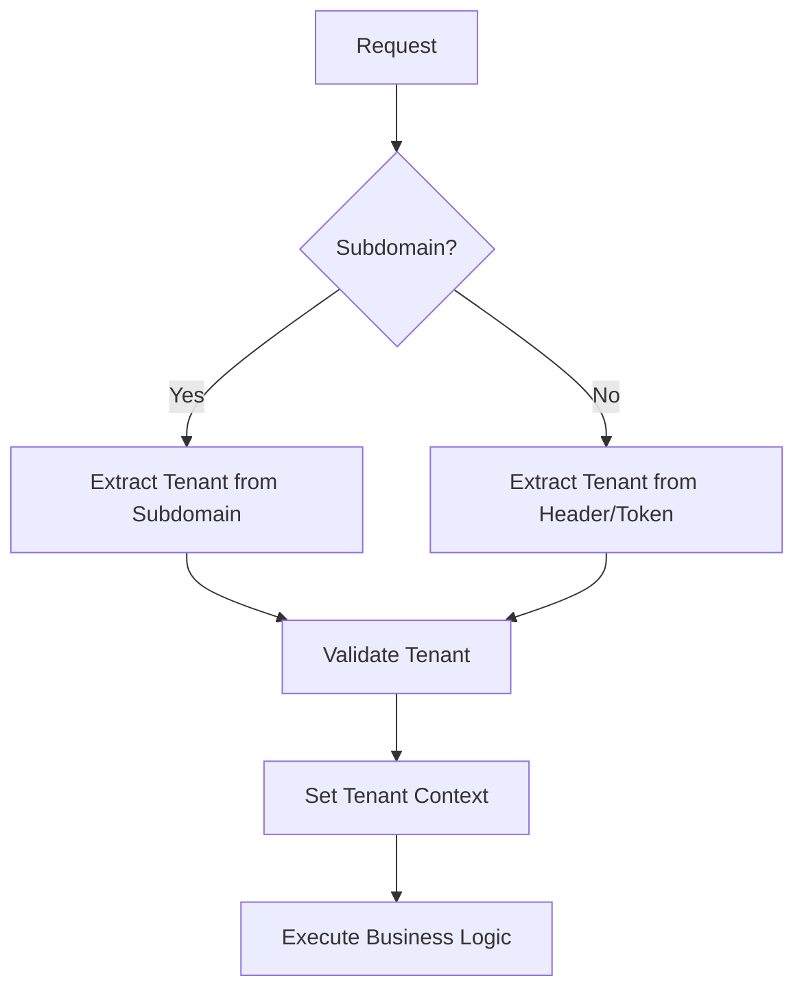

# Arquitetura do Sistema wBJJ

## Visão Arquitetural

### Princípios de Design
- **Multitenancy**: Isolamento completo de dados por filial
- **Escalabilidade**: Suporte a crescimento horizontal
- **Segurança**: Autenticação e autorização robustas
- **Modularidade**: Componentes independentes e reutilizáveis
- **Performance**: Otimização de consultas e cache inteligente

## Arquitetura Multitenancy

### Estratégia de Isolamento
**Tenant por Schema (Recomendado)**
```
Database: wbjj_main
├── tenant_management (schemas globais)
├── tenant_001_academia_alpha
├── tenant_002_academia_beta
└── tenant_xxx_academia_nome
```

### Vantagens da Abordagem Escolhida
- **Isolamento Total**: Dados completamente separados
- **Backup Granular**: Backup por filial
- **Customização**: Esquemas personalizados por tenant
- **Segurança**: Impossibilidade de vazamento entre tenants
- **Performance**: Consultas otimizadas por tenant

## Componentes da Arquitetura

### 1. Backend (API Layer)

#### Estrutura de Diretórios
```
backend/
├── src/
│   ├── core/           # Configurações centrais
│   ├── tenancy/        # Gerenciamento multitenancy
│   ├── auth/           # Autenticação e autorização
│   ├── api/            # Endpoints da API
│   ├── models/         # Modelos de dados
│   ├── services/       # Regras de negócio
│   ├── utils/          # Utilitários
│   └── tests/          # Testes automatizados
├── migrations/         # Migrações de banco
├── docs/              # Documentação da API
└── deploy/            # Scripts de deploy
```

#### Tecnologias Candidatas

**Opção 1: Python + Django/DRF**
- **Prós**: 
  - Ecosystem maduro para multitenancy
  - Django-tenant-schemas
  - Rapid development
  - Excelente para CRUD
- **Contras**: 
  - Performance inferior ao Go
  - GIL limitations

**Opção 2: Python + FastAPI**
- **Prós**: 
  - Performance superior ao Django
  - Async/await nativo
  - Documentação automática (OpenAPI)
  - Type hints
- **Contras**: 
  - Ecosystem multitenancy menos maduro
  - Mais configuração manual

**Opção 3: Golang + Gin/Echo**
- **Prós**: 
  - Performance excelente
  - Concorrência nativa
  - Deploy simples (binary)
  - Memory footprint baixo
- **Contras**: 
  - Curva de aprendizado
  - Ecosystem menor para multitenancy

### 2. Camada de Dados

#### Banco Principal (PostgreSQL)
```sql
-- Schema Global (tenant_management)
CREATE SCHEMA tenant_management;

-- Tabelas Globais
CREATE TABLE tenant_management.tenants (
    id UUID PRIMARY KEY,
    name VARCHAR(255) NOT NULL,
    subdomain VARCHAR(100) UNIQUE NOT NULL,
    schema_name VARCHAR(100) UNIQUE NOT NULL,
    created_at TIMESTAMP DEFAULT NOW(),
    updated_at TIMESTAMP DEFAULT NOW(),
    is_active BOOLEAN DEFAULT TRUE
);

CREATE TABLE tenant_management.users (
    id UUID PRIMARY KEY,
    tenant_id UUID REFERENCES tenant_management.tenants(id),
    email VARCHAR(255) UNIQUE NOT NULL,
    password_hash VARCHAR(255) NOT NULL,
    role VARCHAR(50) NOT NULL,
    created_at TIMESTAMP DEFAULT NOW()
);
```

#### Schema por Tenant
```sql
-- Exemplo: tenant_001_academia_alpha
CREATE SCHEMA tenant_001_academia_alpha;

-- Tabelas por Tenant
CREATE TABLE tenant_001_academia_alpha.students (
    id UUID PRIMARY KEY,
    name VARCHAR(255) NOT NULL,
    email VARCHAR(255),
    phone VARCHAR(20),
    belt_color VARCHAR(20),
    graduation_date DATE,
    created_at TIMESTAMP DEFAULT NOW()
);

CREATE TABLE tenant_001_academia_alpha.payments (
    id UUID PRIMARY KEY,
    student_id UUID REFERENCES tenant_001_academia_alpha.students(id),
    amount DECIMAL(10,2),
    due_date DATE,
    paid_date DATE,
    status VARCHAR(20)
);
```

#### Cache Layer (Redis)
```
Redis Structure:
├── tenant:{tenant_id}:session:{session_id}
├── tenant:{tenant_id}:students:cache
├── tenant:{tenant_id}:payments:due
└── global:tenant_lookup:{subdomain}
```

### 3. Frontend Web

#### Arquitetura SPA (Single Page Application)
```
web/
├── src/
│   ├── components/     # Componentes reutilizáveis
│   ├── pages/          # Páginas da aplicação
│   ├── hooks/          # Custom hooks
│   ├── services/       # Serviços de API
│   ├── store/          # Estado global (Redux/Zustand)
│   ├── utils/          # Utilitários
│   └── types/          # TypeScript types
├── public/
│   ├── assets/         # Assets estáticos
│   └── tenant-assets/  # Assets por tenant
└── tests/              # Testes automatizados
```

#### Multitenancy no Frontend
- **Subdomain Routing**: `{tenant}.wbjj.com`
- **Theme Switching**: CSS customizado por tenant
- **Asset Management**: Logos e assets personalizados
- **Feature Flags**: Funcionalidades por tenant

### 4. Mobile App

#### Arquitetura Mobile
```
mobile/
├── src/
│   ├── screens/        # Telas do app
│   ├── components/     # Componentes reutilizáveis
│   ├── services/       # Serviços e API
│   ├── store/          # Estado global
│   ├── navigation/     # Navegação
│   └── utils/          # Utilitários
├── assets/             # Assets do app
└── tests/              # Testes automatizados
```

## Fluxo de Dados Multitenancy

### 1. Identificação do Tenant


### 2. Database Connection Management
```python
class TenantMiddleware:
    def process_request(self, request):
        tenant = self.get_tenant_from_request(request)
        connection.set_schema(tenant.schema_name)
        request.tenant = tenant
```

## Segurança

### Autenticação
- **JWT Tokens** com tenant_id embedded
- **Refresh Token** rotation
- **Multi-factor Authentication** para admins

### Autorização
- **RBAC** (Role-Based Access Control) por tenant
- **Permissions** granulares por funcionalidade
- **Audit Log** para todas as operações críticas

### Isolamento de Dados
- **Schema-level isolation** no banco
- **Tenant validation** em todas as operações
- **API Rate limiting** por tenant
- **Resource quotas** por tenant

## Performance e Escalabilidade

### Database Optimization
- **Connection Pooling** por tenant
- **Query Optimization** com indexes específicos
- **Read Replicas** para relatórios
- **Partitioning** para tabelas grandes

### Caching Strategy
- **Application Level**: Cache de objetos frequentes
- **Database Level**: Query result cache
- **CDN**: Assets estáticos e imagens
- **Redis**: Sessions e dados temporários

### Monitoring
- **Application Metrics**: Performance por tenant
- **Database Metrics**: Uso de recursos por schema
- **Error Tracking**: Logs centralizados com tenant context
- **Alerting**: Notificações proativas por tenant

## Deploy e DevOps

### Environment Strategy
```
├── development/        # Ambiente local
├── staging/           # Ambiente de testes
├── production/        # Ambiente de produção
└── tenant-specific/   # Ambientes dedicados (grandes clientes)
```

### CI/CD Pipeline
1. **Code Review** → **Automated Tests**
2. **Build** → **Security Scan**
3. **Deploy to Staging** → **Integration Tests**
4. **Deploy to Production** → **Health Checks**
5. **Monitor** → **Rollback if needed**

### Backup Strategy
- **Database**: Backup automático por schema
- **Files**: Backup incremental de assets
- **Configuration**: Versionamento de configurações
- **Disaster Recovery**: Plano de recuperação por tenant 